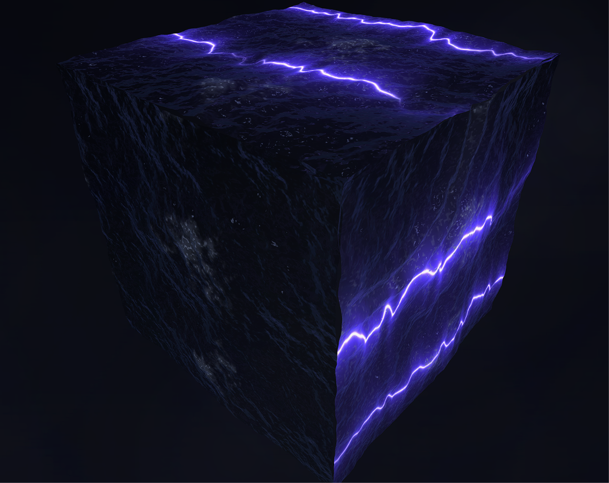
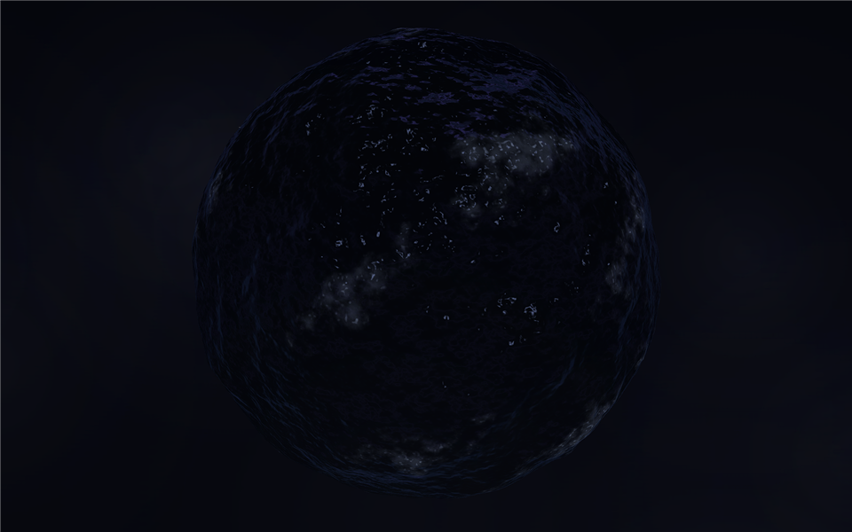
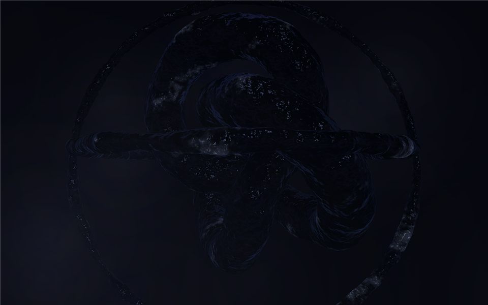
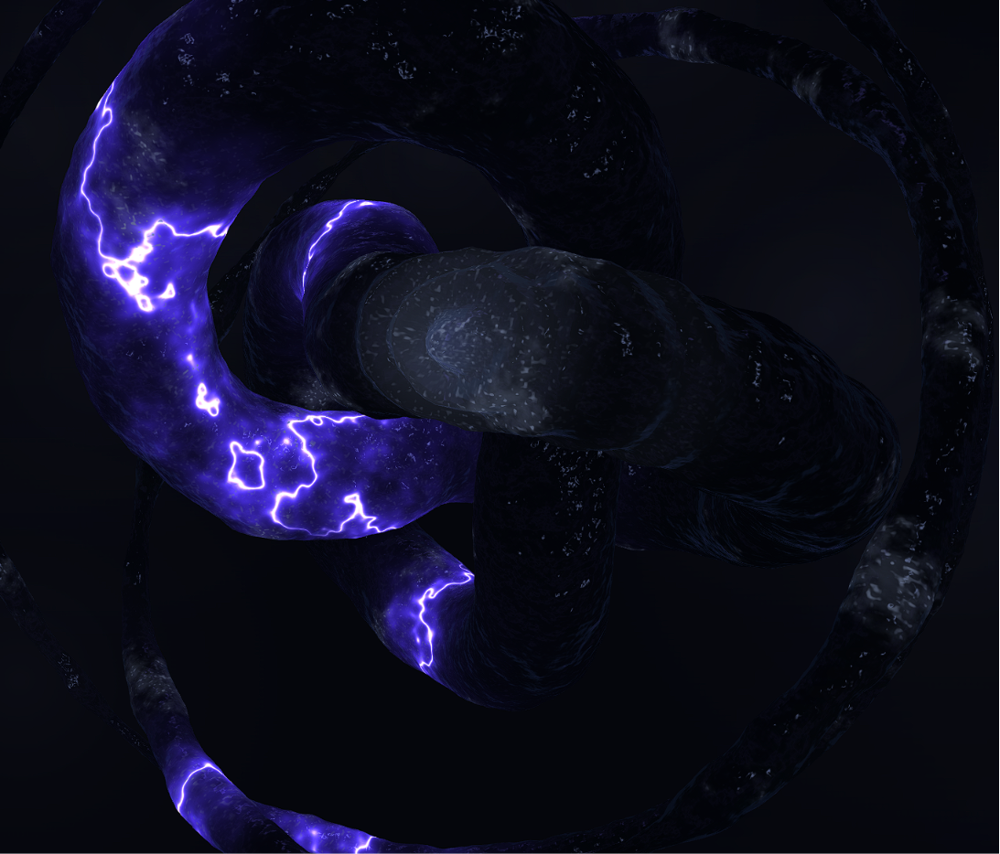
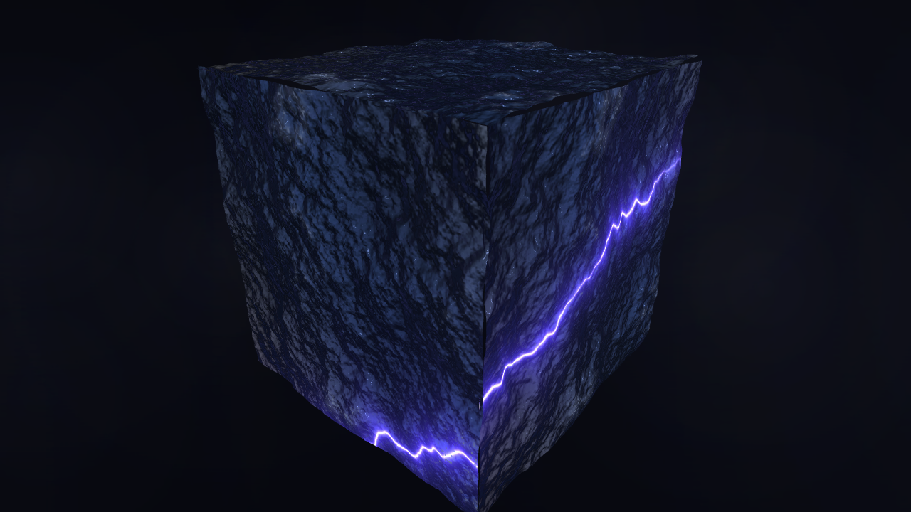
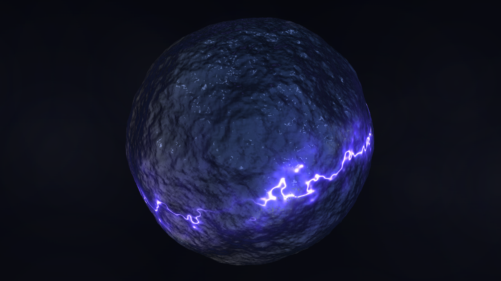
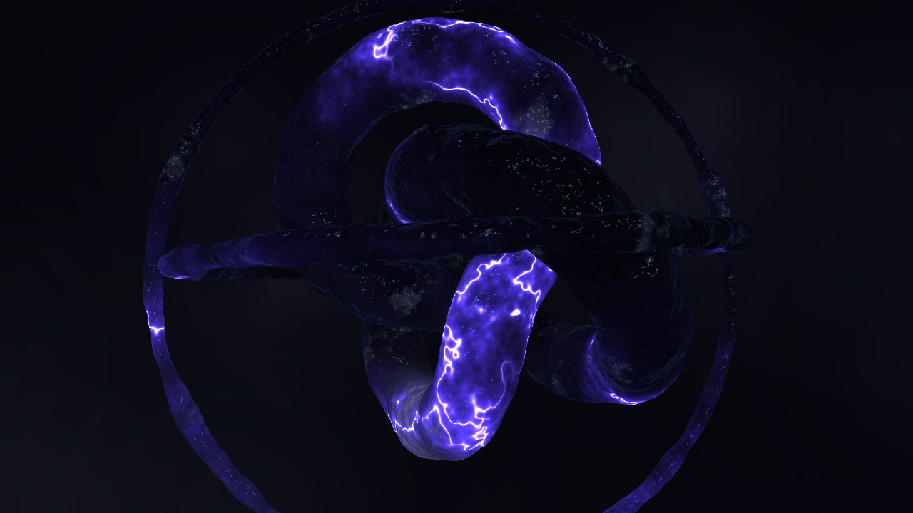
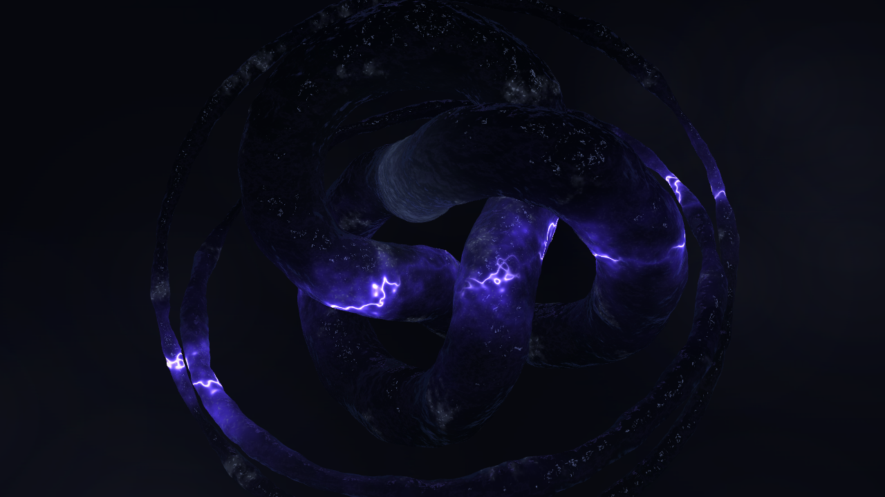

# DarkWaterScreenSaver

A Windows screensaver (`.scr`) that renders dark, stormy Three.js water scenes
(cube, sphere, torus knot) fullscreen via WebView2.

## Scenes

| Cube | Sphere |
|---|---|
|  |  |

| Knot | Knot (alive) |
|---|---|
|  |  |

## Glow

With the **Glow** setting enabled, the scenes are lit from within by a pulsing
light that shifts between glowing white and glowing blue. Cube and sphere glow
across their whole body; in the knot scenes a glowing spot wanders very slowly
along the knot strand. The screenshots below were taken at 80 % glow intensity,
with lightning strikes passing through the water.

| Cube | Sphere |
|---|---|
|  |  |

| Knot | Knot (alive) |
|---|---|
|  |  |

## Requirements

- Windows 10 or 11
- [.NET 10 Desktop Runtime](https://dotnet.microsoft.com/download/dotnet/10.0) (SDK for building)
- WebView2 Runtime (preinstalled on Windows 11 and current Windows 10)

## Build

```powershell
dotnet build DarkWaterScreensaver -c Release
```

The build output lands in `DarkWaterScreensaver\bin\Release\net10.0-windows\` and
automatically contains `DarkWaterScreensaver.scr` (a renamed copy of the `.exe`).

> **Important:** The `.scr` is not standalone. It needs the `DarkWaterScreensaver.dll`,
> the other files next to it, and the `Assets\` folder. Always keep the output
> folder together — do not copy just the `.scr` file elsewhere (e.g. to System32).

## Starting the screensaver modes

Windows calls a `.scr` with fixed command-line arguments. You can also invoke them
manually — use the **`.exe`** for manual testing:

| Command | Mode |
|---|---|
| `DarkWaterScreensaver.exe /s` | Fullscreen screensaver (all monitors, exits on mouse/keyboard input) |
| `DarkWaterScreensaver.exe /c` | Settings dialog (choose scene, or random switching every X minutes) |
| `DarkWaterScreensaver.exe /p <HWND>` | Miniature preview rendered into the given window handle (used by the Windows screensaver dialog) |
| `DarkWaterScreensaver.exe /i` | Interactive viewer: fullscreen on the primary monitor, but mouse and keyboard do **not** end the program — drag to orbit, click/tap for a splash, mouse wheel to zoom. Press **Escape** to quit. |
| `DarkWaterScreensaver.exe` (no argument) | Same as `/c` |

Arguments are case-insensitive; `-s`, `/S`, `/c:12345`, `/c 12345` etc. all work.

> **Note:** Double-clicking the `.scr` file (or launching it via the shell) always
> starts fullscreen mode, because Windows appends `/S` for the default "open" verb.
> To open the settings from Explorer, right-click the `.scr` → **Configure**.

## Installing on Windows

1. Build in Release mode (see above).
2. In `DarkWaterScreensaver\bin\Release\net10.0-windows\`, right-click
   `DarkWaterScreensaver.scr` → **Install**.
3. Windows opens the Screen Saver Settings dialog with "DarkWaterScreensaver"
   selected — set the wait time and confirm with **OK**.
4. The screensaver stays registered to that path, so leave the build output
   folder in place (or copy the whole folder somewhere permanent, e.g.
   `C:\Program Files\DarkWaterScreensaver\`, and install from there).

To open the settings later: Windows Settings → search for "screen saver"
("Bildschirmschoner") → **Settings…** in the Screen Saver dialog, or right-click
the `.scr` → **Configure**.

## Settings

The settings dialog (`/c`) offers:

- **Scene**: cube, sphere, knot, or knot (alive)
- **Random switching**: picks a random scene at start and switches to a
  different random scene every X minutes (1–120, default 10)
- **Glow**: pulsing white/blue inner light — the whole body for cube and
  sphere, a slowly wandering glow spot for the knot scenes

Settings are stored per user in the registry under
`HKEY_CURRENT_USER\Software\DarkWaterScreensaver`
(`Mode`, `SceneFile`, `IntervalMinutes`, `Glow`).
